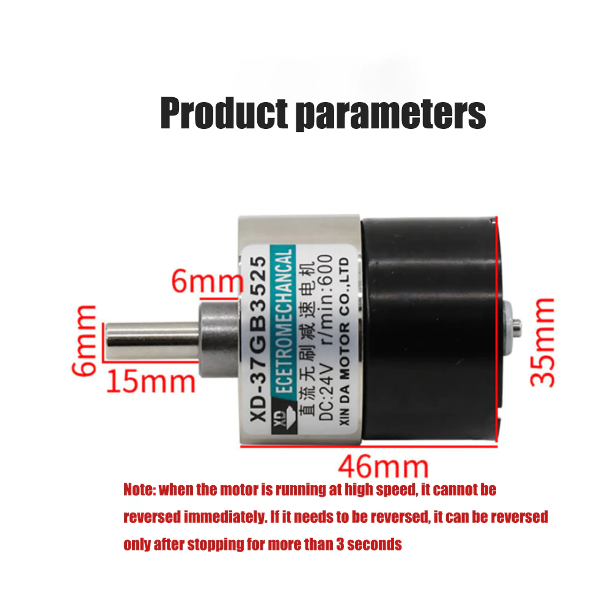
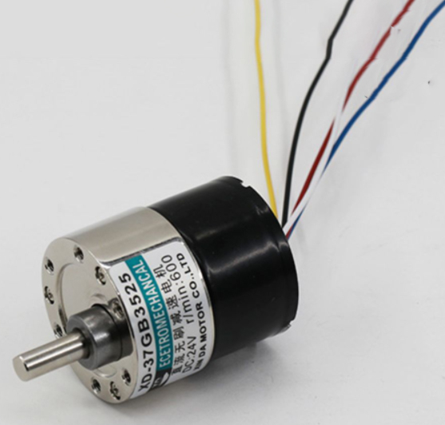

 

Исзодный проект для работы ROS через USB взят отсюда:
https://github.com/yltzdhbc/RosSerialVcp

Проект создан в IDE CLion 2021.2.1

Проект сгененрирован для платы:
Макетная плата STM32F401 STM32F401CCU6 
https://aliexpress.ru/item/4001116638841.html?spm=a2g2w.productlist.0.0.37c72184OQvChE&sku_id=10000014524553288

После чистки и переделки ссылок #include в проекте нормально 
откликается публикатор "kek" ROS при связи с RosSerial через USB

Консольная команда запуска RosSerial:
rosrun rosserial_python serial_node.py /dev/ttySTMusb

Консольная команда просмотра вывода публикатора RosSerial:
rostopic echo /kek 

Команда задания мощности BLDC двигателя : 
rostopic pub -1 /bldc/pwr std_msgs/Float32 -- '1.0'

BLDC(бесщёточный двигатель)
https://aliexpress.ru/item/1005003618686420.html?_ga=2.81464791.1301798713.1654004831-997448704.1629886052&sku_id=12000026519796304

Назначение выводов

- чёрный  -  общий
- красный -  +12v
- синий - PWM сигнал от порта с открытым коллектором(стоком)
- белый - реверс двигателя +/- 5v(сигнал от порта с открытым коллектором(стоком))
- жёлтый - выход датчика Холла

